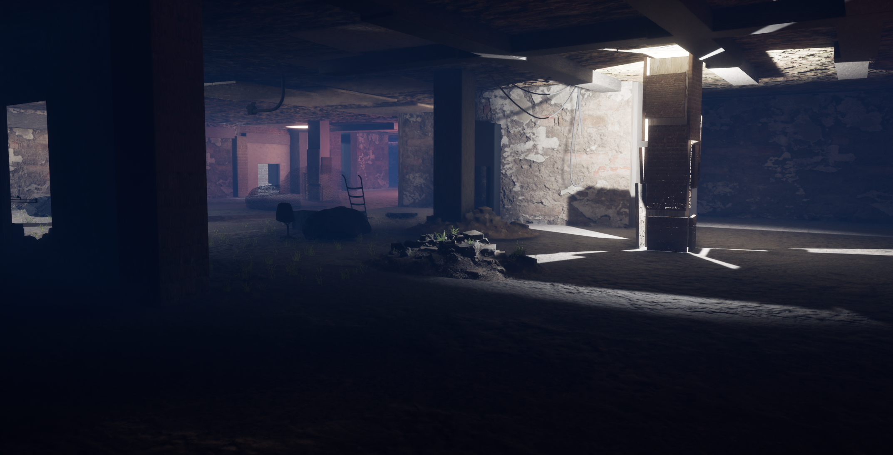
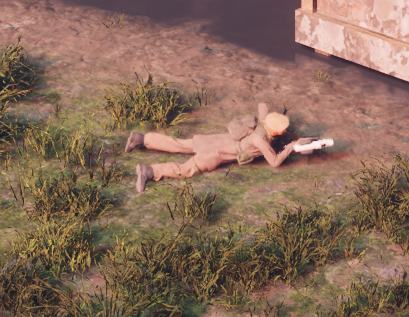
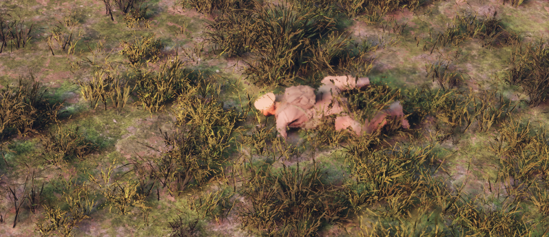

[](https://github.com/MagaKaStoporom/TheFirstOne)
[](https://github.com/MagaKaStoporom/TheFirstOne/blob/main/LICENSE)
[](https://www.unrealengine.com/)
[](https://github.com/MagaKaStoporom/TheFirstOne)

<p align="center">
  
</p>

# 🔥 THE FIRST ONE: ИДЕАЛЬНАЯ ШЕСТЁРКА

> *код игры не выкладывается и не распространяется в паблики.

> *«3069 год. Мир рухнул.»*  
> Тысячу лет назад случилась Катастрофа. Всё, что осталось, — пустыня, руины и выжившие.  
> Ты — не герой. Ты — один из тех, кто не сдался.

**📅 21 декабря 2026 — ДАТА РЕЛИЗА**

---


## Почему «The First One»?

Название **The First One** — это не просто слова. Это философия игры.

### 🧠 1. Первая игра
Это мой первый большой проект. Я начал его с нуля, без команды, без бюджета. The First One — это точка отсчёта.

### 🌍 2. Первый выживший
В мире 3069 года, после Катастрофы, люди делятся на тех, кто сдался, и тех, кто выжил. Герои TFO — не просто персонажи. Они — те, кто не ушёл в песок.

### 📖 3. Первая глава вселенной
The First One — это начало. Будут и другие игры, но эта — фундамент. Она задаёт тон, мир и законы.

### 🎯 4. Первый шаг игрока
Когда ты запускаешь игру, ты не просто «начинаешь играть». Ты делаешь первый шаг в пустыню. И от тебя зависит, станешь ли ты первым, кто дойдёт до конца.

---

**The First One** — это не про спасение мира.  
Это про то, чтобы **не сдаться первым.**

---

## Как появился TFO? 

Один из разработчиков — **MagaKaStoporom** — с детства мечтал о своей игре. 8 лет ушло на то, чтобы продумывать мир, персонажей и механики. И только сейчас, спустя время, эта мечта начинает воплощаться в коде, текстурах и анимациях.

**The First One** — это не просто проект. Это — реализация того, что жило в голове долгие годы.


## 🎮 ОБ ИГРЕ

**The First One: Идеальная Шестёрка** — это постапокалиптический action-adventure с видом от первого лица и уникальной механикой переключения между тремя героями.

| Особенность | Описание |
|:---|:---|
| 🌍 **Огромный мир** | 22 км² пустыни, гор, деревень и крепостей |
| 👥 **Три героя** | Молли, Юрий и Данте — у каждого свой стиль боя |
| 💥 **Жестокая боевка** | От первого лица, с телом, отдачей и весом оружия |
| 💀 **Уникальная смерть** | Не респавн, а «память о смерти» с переходом в Мёртвые Земли |
| 🪙 **Экономика с подвохом** | «Дыдкоины» — валюта, которая обманывает тебя |
| 🤝 **Кооператив** | Просто заходи с друзьями и исследуй мир |

---

## 🗺️ МИР TFO

| Регион | Описание |
|:---|:---|
| 🏔️ **Пустой Дозор** | Город на горе, где ветер и тишина |
| ⛰️ **Горный Хребет** | Деревни, разбросанные по скалам |
| 🏚️ **Анбадди** | Заброшенные дома, граффити и эхо |
| 🏰 **Форт Улус Джужи** | Древняя крепость с деревушкой рядом |

<p align="center">
  
  
</p>
<p align="center">
  
  
</p>

---

## 👥 ГЕРОИ

| | Герой | Стиль | Оружие |
|:---:|:---|:---|:---|
| 🔵 | **Молли** | Скрытность, стелс | Пистолет |
| 🔴 | **Юрий** | Сила, танк | Дробовик |
| 🟠 | **Данте** | Агрессия, уличный бой | Кулаки + дробовик |

---


## 📸 СКРИНШОТЫ

<p align="center">
  
  
  
</p>

---

## 🛠️ СТРУКТУРА ПРОЕКТА

```mermaid
graph TD
    A[The First One] --> B[Мир 22 км²]
    A --> C[3 героя]
    A --> D[Механики]
    A --> E[Мультиплеер]
    
    B --> B1[Пустой Дозор]
    B --> B2[Анбадди]
    B --> B3[Форт Улус Джужи]
    
    C --> C1[Молли — стелс]
    C --> C2[Юрий — сила]
    C --> C3[Данте — агрессия]
    
    D --> D1[Смерть в Мёртвых Землях]
    D --> D2[Блок]
    D --> D3[Дыдкоины]
