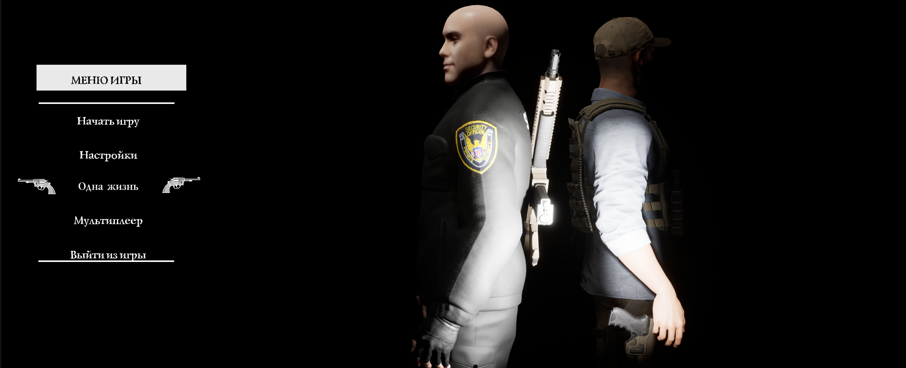

  

# 🔥 THE FIRST ONE: ИДЕАЛЬНАЯ ШЕСТЁРКА

**3069 год. Мир рухнул.**
Тысячу лет назад случилась Катастрофа. Всё, что осталось, — пустыня, руины и выжившие. Ты — не герой. Ты — один из тех, кто не сдался.

**[21 декабря 2026] — ДАТА РЕЛИЗА** / RELEASE

---

## 🎮 ОБ ИГРЕ / ABOUT A GAME

**The First One: Идеальная Шестёрка** — это постапокалиптический action-adventure с видом от первого лица и уникальной механикой переключения между тремя героями.

*   **Огромный мир:** 22 км² пустыни, гор, разрушенных деревень и древних крепостей.
*   **Три героя:** Молли, Юрий и Данте. У каждого свой стиль боя, своё оружие и своя история.
*   **Жестокая боевка:** От первого лица, с телом, отдачей и тяжёлой перезарядкой.
*   **Уникальная смерть:** Это не респавн. Это — «память о смерти» с переходом в Мёртвые Земли.
*   **Экономика с подвохом:** «Дыдкоины» — валюта, которая обманывает тебя. Покупаешь броню — она замедляет. Карту — она ведёт в ловушку.
*   **Кооператив:** Просто заходи с друзьями и исследуй пустыню.

---

## 🗺️ МИР TFO / World a game The First One (TFO)

*   **Пустой Дозор** — город на горе, где ветер и тишина.
*   **Горный Хребет** — деревни, разбросанные по скалам.
*   **Анбадди** — заброшенные дома, граффити и эхо.
*   **Форт Улус Джужи** — древняя крепость с деревушкой рядом.

  
  
    
  

---

## 👥 ГЕРОИ / CHARACTERS 

| | Герой | Стиль | Оружие |
| :---: | :--- | :--- | :--- |
|  | **Молли** | Скрытность, стелс | Пистолет |
|  | **Юрий** | Сила, танк | Дробовик |
|  | **Данте** | Агрессия, уличный бой | Кулаки + дробовик |

---

## 📸 СКРИНШОТЫ / SCREENSHOTS

  
  
  

---

## 🛠️ ТЕХНОЛОГИИ / TECHNOLOGY

*   **Движок:** Unreal Engine 5
*   **Язык:** Blueprints / C++
*   **Сеть:** Steam Online Subsystem (планируется)

---

## 🚀 КАК ПРИНЯТЬ УЧАСТИЕ / How become collab ?

1.  **Следи за новостями:** Официальный сайт и этот репозиторий — главные источники.
2.  **Итоговая конференция:** [1 октября 2026] в [16:00 по МСК]. Будет много новостей.
3.  **Релиз:** [21 декабря 2026]. Не пропусти.

---

## 🐞 СООБЩИТЬ О БАГЕ / FEEDBACK OF BUG

Нашёл баг? Создай Issue в этом репозитории.

Found bug? Create issue for it repository 

---

## 📜 ЛИЦЕНЗИЯ / LICENSE

Этот проект распространяется под лицензией MIT. Подробности в файле `LICENSE`.
This is project by license MIT. More Information in the file 'LICENSE'. 
---

## 🙏 БЛАГОДАРНОСТИ / YOU TOO

Спасибо всем, кто поддерживает проект!
Thank you all, that supports my prroject!

---

⭐ **Поставь звезду репозиторию, если ждёшь TFO!** ⭐
Give me the start it repository, if you wait a game TFO
